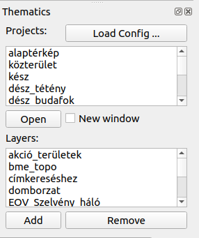

# thematics
QGIS plug-in to select projects and thematics from a given list

This plug-in was created to help the use of several projects and layers with
a click of the mouse. Stating the plug-in a new panel displayed.



The panel contains pre-configured projects (upper part) and individual layers 
(lower part). Select a project from the list and push **Open** button or double 
click on the project name. The previous project will be closed.
If you check New window checkbox, a new QGIS windows will be opened.
Pushing **Load Config...** button you can open an other configuration file 
with another set of projects and layer.

From the lower list you can add and remove layers from the actual project.
Select the name of the layer and push **Add** or **Remmove** button.

The default configuration, which is loaded automatic when the plug-in loaded,
is located in the folder of the plugin (called *default.cfg*).
There are four type of available groups in configuration file:

[base]

There is only one  parameter for this group *dir* which is a base directory
for all the following relative paths of data sets and project files.

[projects]

In the project group you can add your projects in the form

visible name of project = relaltive or absolute path to project file (qgz)

[layer_group*n*]

Where *n* is a number to make the group name unique. In the layer group one
name parameter can be given and more layer*n* parameters. For layers
assign the path to the layer. In the layer list in panel of the plug-in, only
the name will be visible and the layers in the group can be added/removed as 
a unit. The path to the layer can be a valid url to point to a WMS/WFS 
server.

[include]

You can use this group to redirect to an external file giving a *path*.
The rest  of the config file is not considered. This can be useful for a
group of users using common projects/layers from a network drive.
They can create a local configuration to include a common configuration on a
network drive. So a single config can be administered centrally.

You can add comment to the config file starting a line with semicolon.

Sample configuration file

```
    ; sample config file for thematics plug-in
    [base]
    dir = /home/user/demo
    [projects]
    base_map = projects/base.qgz
    other_map = projects/other.qgz
    third_map = other/projects/third.qgs
    [layer_group1]
    name = orthophoto
    layer1 = url=http://your_wms_server/link
    [layer_group2]
    name = extra layers
    layer1 = project/layers/trees.shp
    layer2 = project/layers/bushes.tab
```

The development of this plug-in was supported by the local municipality of
XXII disctrict of Budapest, Hungary.
